# rNoz changes

The next features are listed in development order. Therefore, new features can improve and extend previous features.

## Main features

### AUR package

Electron-builder does not offer aur packages. Therefore, in the directory `support/package-aur` we can build those for ArchLinux/Manjaro distributions. It is "optimized" and just installs around 50MiB, using the system electron, as it is exposed here [issue 4059](https://github.com/electron-userland/electron-builder/issues/4059).

```sh
bash support/package-aur/manager.sh pack # can be omitted if using the archive from the repo
bash support/package-aur/manager.sh makepkg
```

Before publishing a release, you have to update the PKGBUILD:

```sh
# using npm script:
npm run release:aur

# alternatively, with the shell:
bash support/package-aur/manager.sh pack pkgbuild
```

The second target (`pkgbuild`) will update the version and md5sums of the PKGBUILD.


### Auth

- Login accepts both API or Username+Password as login method:

  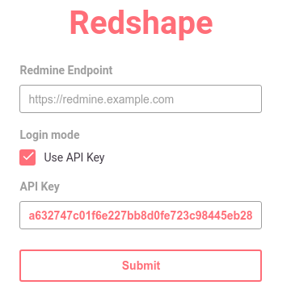

### Durations

- Duration: you can use hours, and it is rounded as it will be used in Redmine

  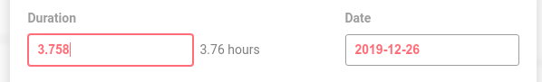

- Duration: hours are not positive enough (15s rounded => 0)

  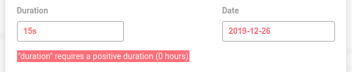

- Duration: empty

  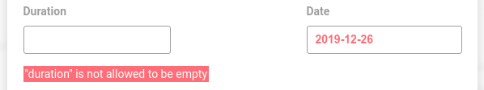

- Duration: negative

  

- Duration: duration formats (2 examples)

  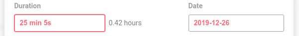

  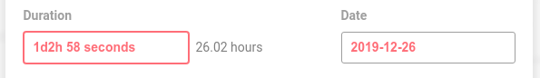

- Time Entries are casted to duration formats when editing. For example, this:

  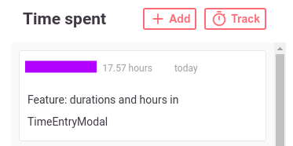

  When it is clicked, it is automatically converted to the most comfortable duration format:

  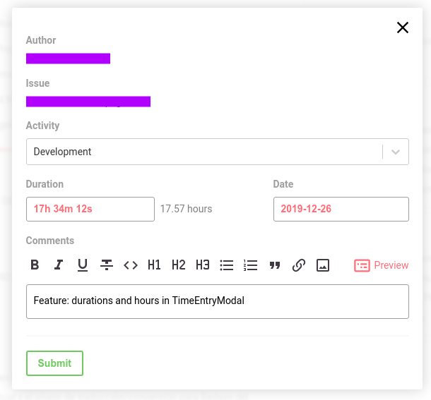

- When tracking an issue:

  

  When it is stopped, it is properly filled:

  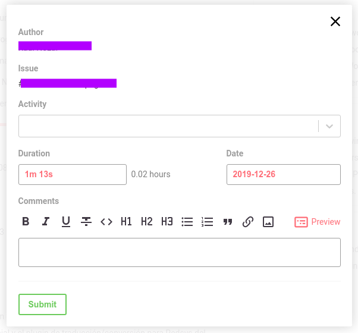

- Added info tooltip for the duration field:

  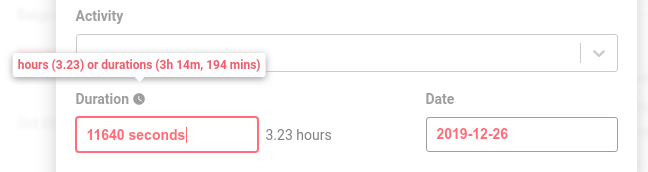

### TimeEntryModal

- When closing the modal of a modified entry or non saved entry (stopped), we need to confirm:

  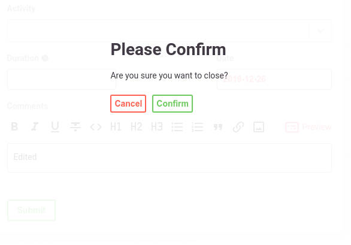

- Validations in TimeEntryModal are performed per field (onBlur), to avoid annoying errors in fields we didn't modify yet.

### Tray

- Added tray, allowing to hide in tray/show window, because most of the time the Redshape window is not needed.

- Tray with pause/resume button of current timer (long/short issue subject):

  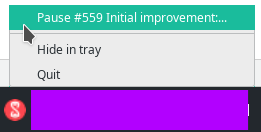
  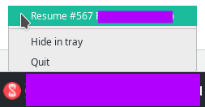

- Tick optimizations when using Redshape in tray. This are debug messages not present in the app. They are just printed here to show
  the optimization. We reduce the CPU usage.

  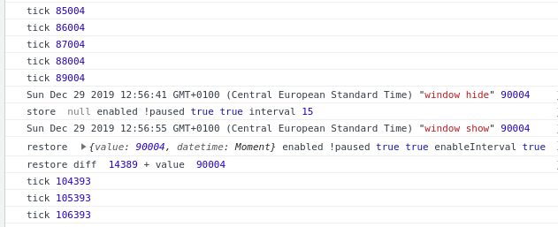

- New icons are provided for the tray, showing when it is tracking an issue (play, pause) or not.

### Advanced Timer Controls

- The view can be advanced or simple. When using advanced view, we can use new buttons to modify the current time (1 or 5 minutes) and write temporary comments. Using these, we can directly modify the time in case we were interrupted in the task (avoid remembering those changes until the end). Also, the comments help us in workflows where our time entry can be hours long.

  

  

  When we finish, we have updated our TimeEntryModal:

  

### Idle behavior

- Redshape can pause the timer if it detects the system is idle for a range of times (5, 10 o 15 minutes). It will warn with notifications (15s. warning time before pausing).

- Optionally, it can automatically discard the idle time from the current timer when it is paused.

### Settings

- New settings menu to be used per user/redmine host.

  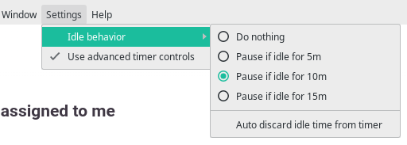

### Minor bugfixes

- There are other minor bugfixes and features not listed but can be read in the git log. Those are usually related with UX, propagating correctly the state, etc.

### Issue progress bars

- Progress (done ratio) shows a gradient of 5 colors between red-yellow-green (0, 20, 40, 60, 80, 100%).

  Time cap shows a green bar between 0-80% and yellow-green in the last 20%. When it is overtime (eg. 150%), a red bar is shown with the overtime proportion (eg. 50/150).

  Tooltips added showing the specific percentage value.

  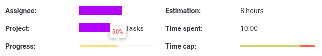

### Custom fields

- Custom fields are shown in the issue details page (if available).

  

### Edit issue

- Progress (done ratio) can be edited in a new modal. It supports an input range to slide the percetage of progress (0 to 100).

  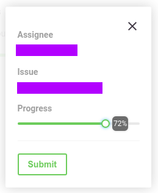

- Estimation (hours) and Due date can also be edited.

  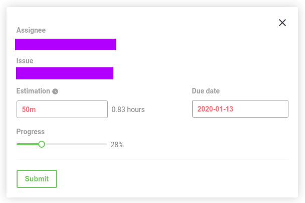

- If editing a parent task, some non-editable fields are omitted.

  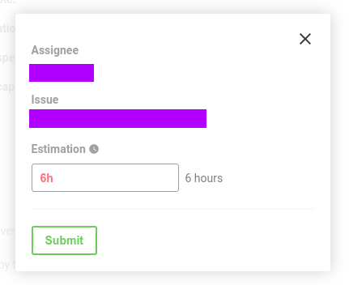

### Issue fields

- If is a parent task, it shows links to each of its subtasks.

  If is a parent task, it shows the totals (estimated and spent time).

  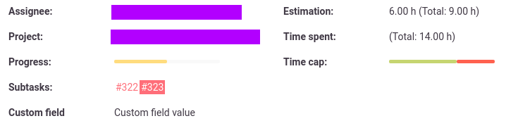

### More settings

- Issue progress slider can be changed with 1% step if configured (by default is 10%).
  Enable this if you have support in the server side (ruby, redmine) to use every percentage (33%, 81%, etc).

  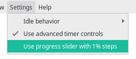

### New style

- Three styles: default, default with colors and enhanced. The latter, enhanced, is a custom Group4Layers theme (originally based on the Purplemine theme). Therefore, it may modify the interface without restrictions associated to the original design of Redshape.

### Issue fields

- When enabling in server side (via plugins), Redshape will show more fields, like:

- Issue: tags

- Issues: spent hours, total spent hours and total estimated hours.

- Status

### New settings menu

- Removed the settings menu from the window menu. Everything is ported as a new page. New components.

### Migrations

- Added migration of settings between versions.

### Even more features

- Pause timer when suspend/shutdown.

- Timer with checkpoints (configurable) to save state periodically when shutdown does not work.

- Bugfixes: MarkdownEditor only clean the textarea when the comments are sent.

- Two views: issues assigned to me or created by me.

- Editing an issue can be performed (configurable). The server will decide what to do (permissions).

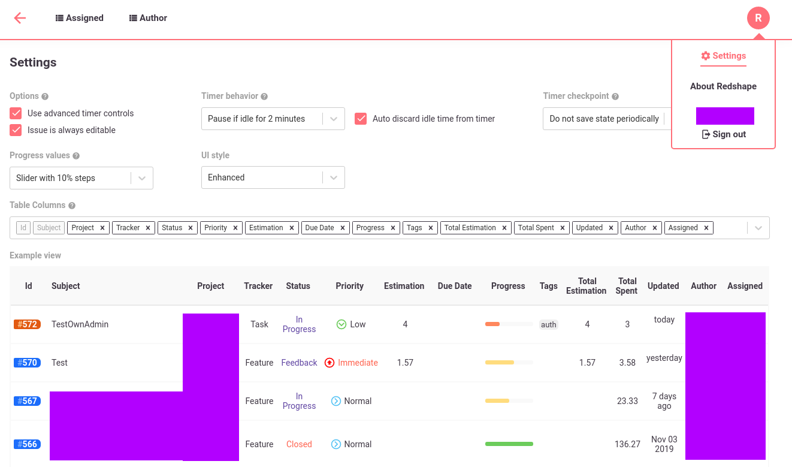

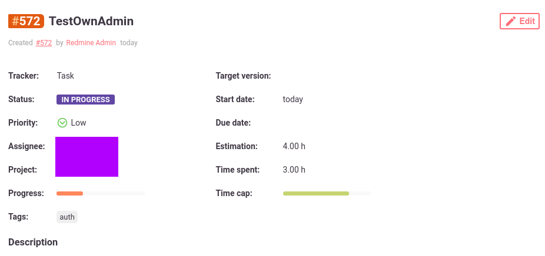

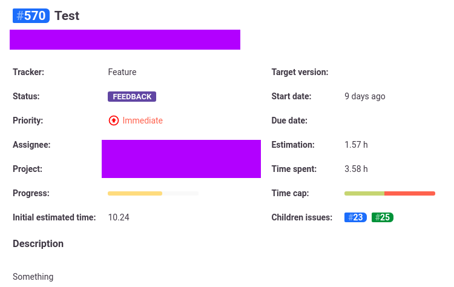

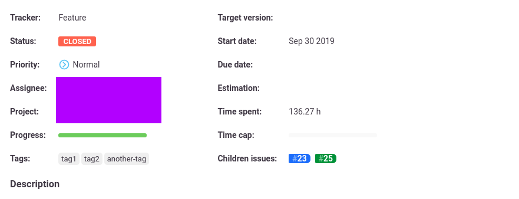

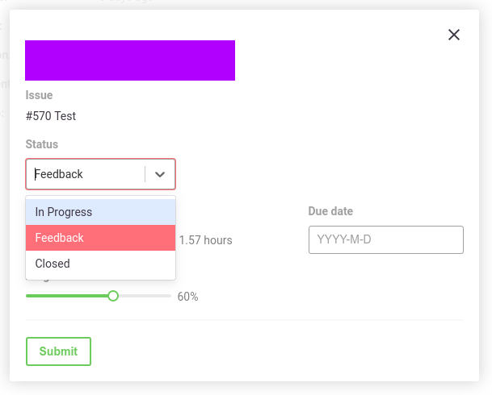

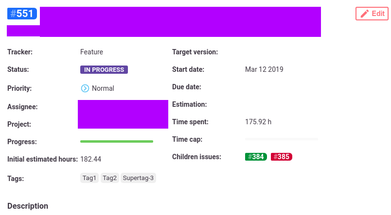

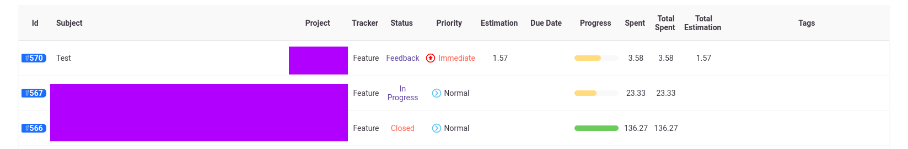

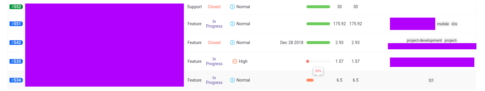

### Comments improved

- If supported in server-side, comments can be removed and edited.

- Comments can be sorted asc/desc.

- Editor can be hidden/visible.

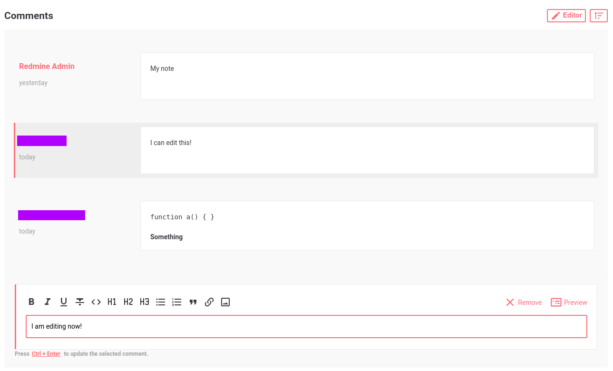

### TimeEntries with more fields

- Activity and custom fields are shown in Enhanced view:

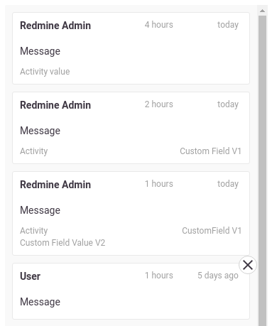

## Recommended settings

After the modifications performed to this repository (listed in gnews.md), we recommend:

- Use advanced timer controls.
- Issue is always editable (so, the creator/assignee can modify if possible).
- Comments are editable (only if server-side support - REST API for journals).
- Timer checkpoint: every 5/10 minutes (assuming suspend works by default in your system).
- UI style: enhanced.
- Progress values: 1% (only if server-side support - viewing/editing 1% values in redmine web is possible).

## Known issues

- Tray new icons should be ported for Mac (png to icns; png2icns gives black background).
- Changes not tested in Mac or Windows.
- One test is omitted from the original repo (TimeEntryModal, it should match the snapshot) because it never finishes (throws JS heap out of memory).
- As soon as Electron v8 is stable, it should be used (package.json). Redshape is prepared for future features (timeoutType), keeping the notification when the timer is paused due to system idle.

## Acknowledgements

- [Daniyil Vasylenko](redshape.app@gmail.com): original author of this interesting and useful project.
- [Group4Layers](https://www.group4layers.com): it is possible to contribute to this repository and achieve the new features provided here thanks to this company and its efforts to promote and work with open source. A whole month of dedication has been given in hours assigned by the company.
